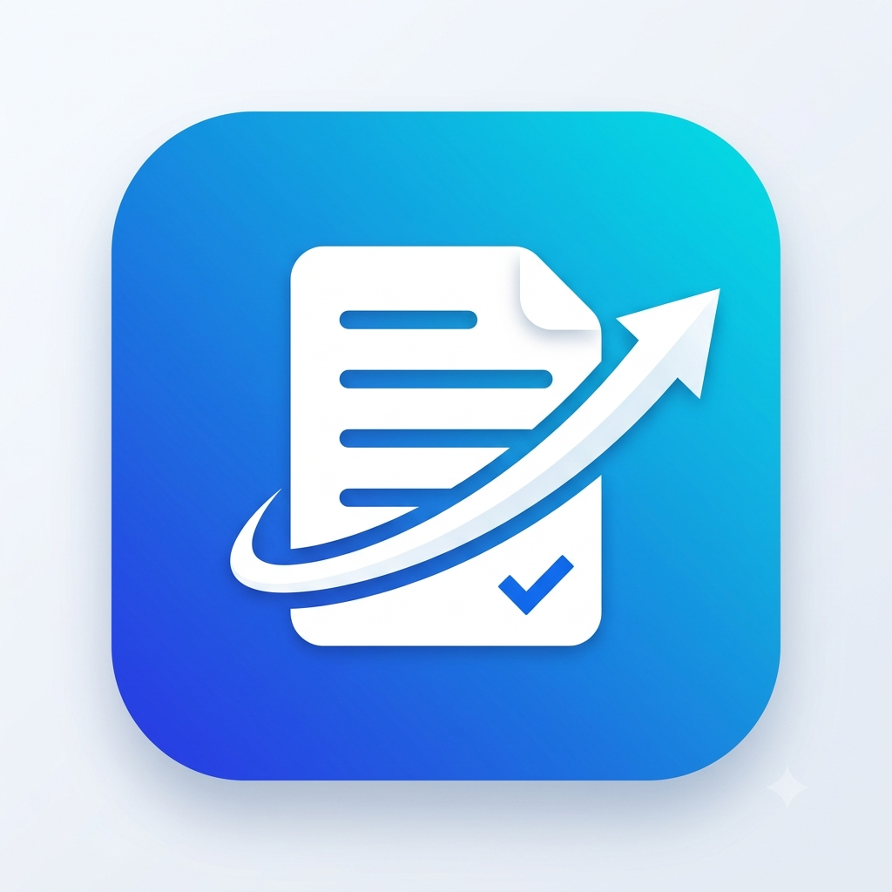
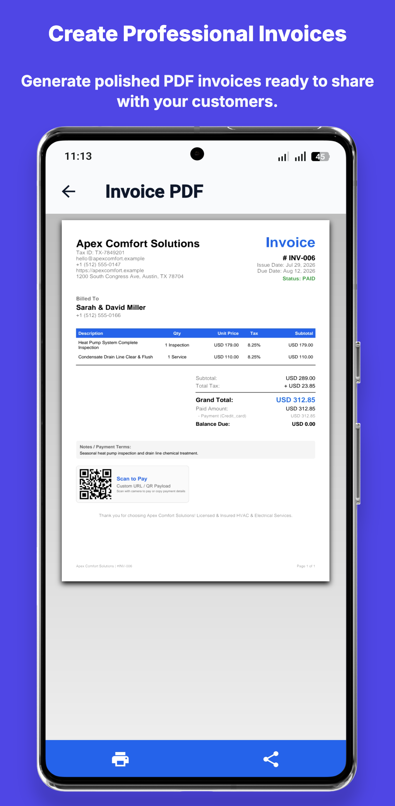
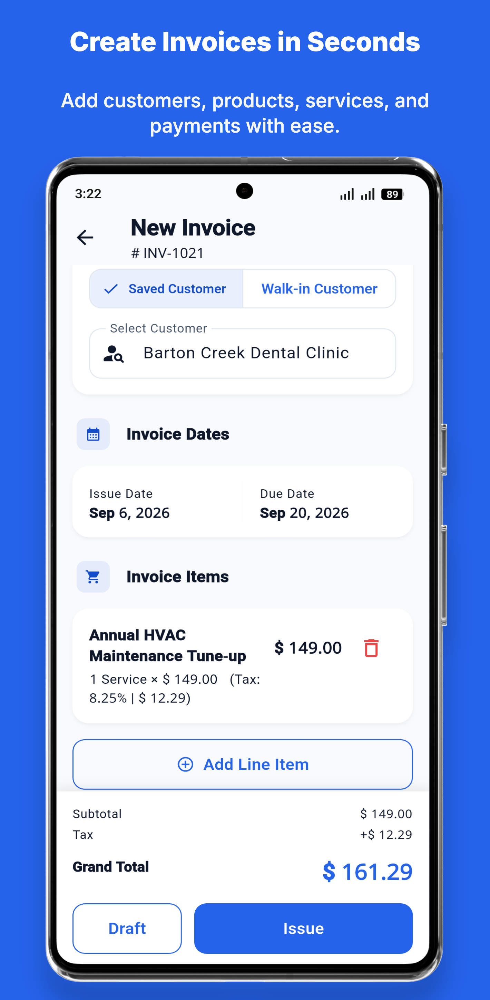
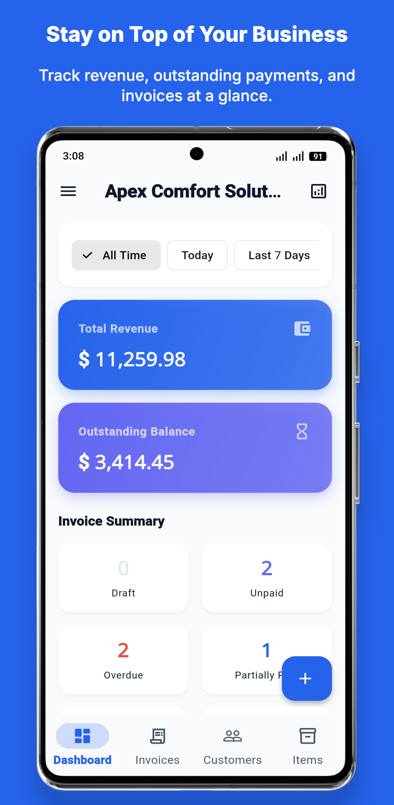
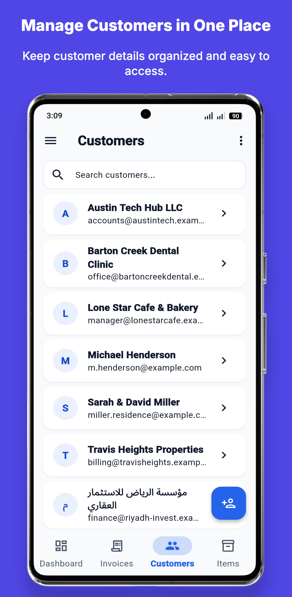
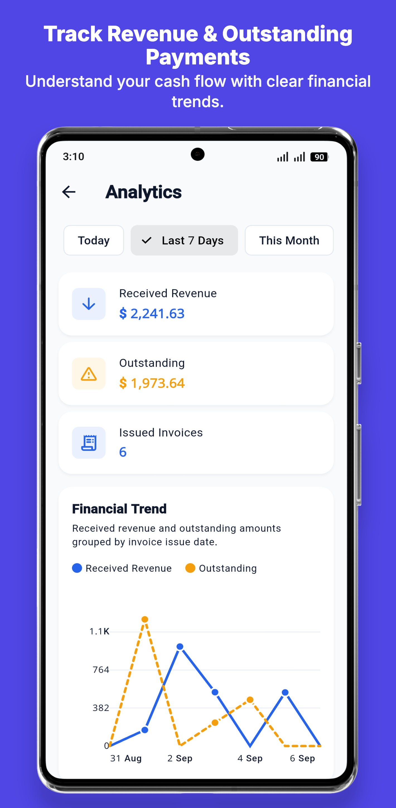
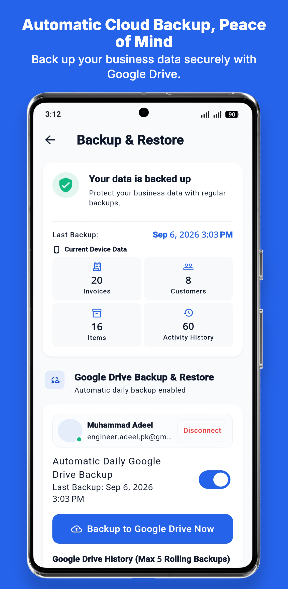
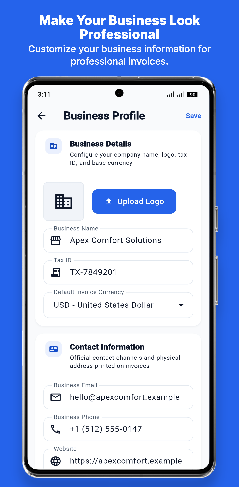
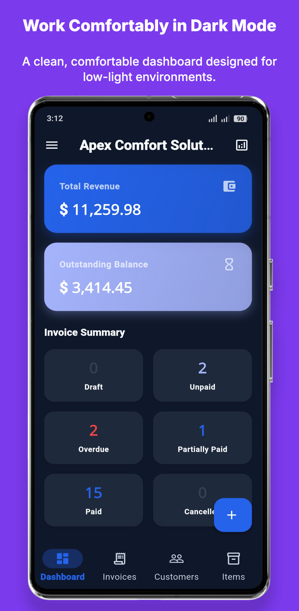

<div align="center">

  

  # InvoiceFlow Pro
  
  **A production-grade, offline-first mobile invoicing, billing, and client accounting application built with Flutter & Dart.**

  [](https://flutter.dev)
  [](https://dart.dev)
  [](https://blog.cleancoder.com)
  [](https://isar.dev)
  [-brightgreen?style=for-the-badge)](https://github.com/madeel931)
  []()
  []()

  <p align="center">
    Built for freelancers, contractors, tradespeople, and small business agencies who demand instant, reliable invoicing with complete data privacy and zero mandatory cloud subscriptions.
  </p>

</div>

---

## 📱 Visual Showcase

<table>
  <tr>
    <td align="center" width="25%">
      
      <br /><strong>Professional PDF & QR Pay</strong>
    </td>
    <td align="center" width="25%">
      
      <br /><strong>10-Second Invoice Creation</strong>
    </td>
    <td align="center" width="25%">
      
      <br /><strong>Executive KPI Dashboard</strong>
    </td>
    <td align="center" width="25%">
      
      <br /><strong>Client CRM & Balances</strong>
    </td>
  </tr>
  <tr>
    <td align="center" width="25%">
      
      <br /><strong>Revenue Trends & Cash Flow</strong>
    </td>
    <td align="center" width="25%">
      
      <br /><strong>Google Drive Cloud Sync</strong>
    </td>
    <td align="center" width="25%">
      
      <br /><strong>Custom Logo & Branding</strong>
    </td>
    <td align="center" width="25%">
      
      <br /><strong>AMOLED Dark Theme</strong>
    </td>
  </tr>
</table>

---

## 🌟 Executive Overview

**InvoiceFlow Pro** is an enterprise-grade, offline-first mobile invoice management suite crafted by **ADii Labs**. 

Unlike SaaS alternatives that lock users behind steep monthly subscriptions and slow internet round-trips, InvoiceFlow Pro delivers:
* **True Local-First Privacy:** All invoices, customer records, and product catalogs are stored locally on the user's device via an ultra-fast **Isar NoSQL** database engine.
* **Instant Native PDF Generation:** Clean vector PDF invoices generated on-device in milliseconds, complete with dynamic QR codes for direct client payment.
* **Zero Cloud Hosting Costs:** No external backend required for core operations. Optional **Google Drive cloud synchronization** gives users private, automated backups without third-party server exposure.

---

## 🚀 Key Feature Highlights

### 📄 1. High-Performance PDF Engine & Direct Sharing
* Instant on-device PDF generation with sharp vector typography and custom business logos.
* Built-in **Scan-to-Pay QR Code** (supports custom payment URLs, IBANs, or UPI links).
* Pre-configured single-tap sharing via **WhatsApp**, **SMS**, **Email**, and native print spoolers.
* Dedicated **Customer Account Statement PDF** export showing full debit/credit transaction history.

### 🔒 2. Dual-Layer Backup & Security
* **Automated Daily Google Drive Sync:** Silently creates rolling cloud snapshots strictly inside the user's private Google Drive app data storage.
* **Cryptographic SHA-256 Integrity Verification:** Every backup file is hashed to prevent corruption during restore.
* **Local Offline Backups:** Manual export/import of unencrypted or encrypted local snapshots to external storage or device transfer.

### 📊 3. Financial Analytics & Real-Time KPIs
* Executive dashboard tracking **Total Revenue**, **Outstanding Balances**, and **Invoice Status Counts**.
* Interactive **Revenue Trend Line Charts** and **Status Breakdown Donut Charts** powered by `fl_chart`.
* Real-time chronologically sorted **Activity Audit Log** capturing every business transaction.

### 🌐 4. Multilingual RTL & Global Multi-Currency
* Native support for **English (LTR)**, **Arabic (العربية - RTL)**, and **Urdu (اردو - RTL)**.
* Proper bidirectional text shaping with `arabic_reshaper` and `bidi`.
* Comprehensive currency picker supporting 150+ global currencies (USD, EUR, GBP, SAR, AED, PKR, INR, etc.).

### 👥 5. Integrated Customer CRM & Rate Card Catalog
* Customer directory with instant balance calculations and quick call/SMS buttons.
* Rate card catalog for recurring services and physical parts with automatic tax rate calculation.

### 💎 6. Freemium & Monetization Ready
* Pre-wired with **RevenueCat In-App Purchases** (`purchases_flutter`).
* Toggle between 100% free offline mode or paid subscription tiers via a single config flag (`ENABLE_IAP=true`).

---

## 🏗️ Technical Architecture & Code Quality

InvoiceFlow Pro is engineered according to **Domain-Driven Clean Architecture** and SOLID principles:

```text
lib/
├── config/              # Centralized theme, branding & app constants
├── core/                # Reusable UI primitives, PDF engine & device services
└── features/
    ├── analytics/       # Cash flow charts and financial trend reporting
    ├── backup/          # Google Drive sync & local file snapshot engine
    ├── customers/       # CRM directory & account statement generator
    ├── dashboard/       # Executive KPI counters & quick action shortcuts
    ├── invoices/        # Core invoice builder, PDF renderer & status manager
    ├── items/           # Products & services catalog
    ├── onboarding/      # First-run setup & commercial demo seeder
    └── settings/        # Currency, tax rates, theme mode & profile
```

### Engineering Rigor:
* **State Management:** `flutter_bloc` (BLoC / Cubit) for predictable, reactive UI flow.
* **Dependency Injection:** `get_it` service locator.
* **Automated Test Coverage:** **508 automated unit and widget tests** validating calculation immutability, date-range filtering, and error fallbacks.
* **Analyzer Health:** **0 lint errors, 0 warnings** with strict `flutter_lints`.

---

## 📦 Commercial Acquisition & Licensing

This repository serves as a **public product showcase**. The complete, production-ready source code is available for commercial purchase, white-label deployment, and client licensing:

* **Commercial Marketplaces:** Available on **[Codester](https://www.codester.com)** and **CodeCanyon**.
* **What Buyers Receive:**
  * Complete, clean Flutter source code for **Android & iOS**.
  * Complete offline HTML & Markdown documentation.
  * 1-command white-label rebranding script.
  * Pre-configured **Demo Mode** (`--dart-define=DEMO_MODE=true`) with realistic business data.
  * Lifetime codebase updates.

---

## 📬 Contact & Custom Development

Looking for white-label rebranding, custom enterprise integrations, or custom Flutter development?

* **Developer:** Muhammad Adeel
* **Company:** ADii Labs
* **GitHub:** [@madeel931](https://github.com/madeel931)
* **Email:** [engineer.adeel.pk@gmail.com](mailto:engineer.adeel.pk@gmail.com)

---

<div align="center">
  <sub>Designed & Developed with precision by <strong>ADii Labs</strong>.</sub>
</div>
