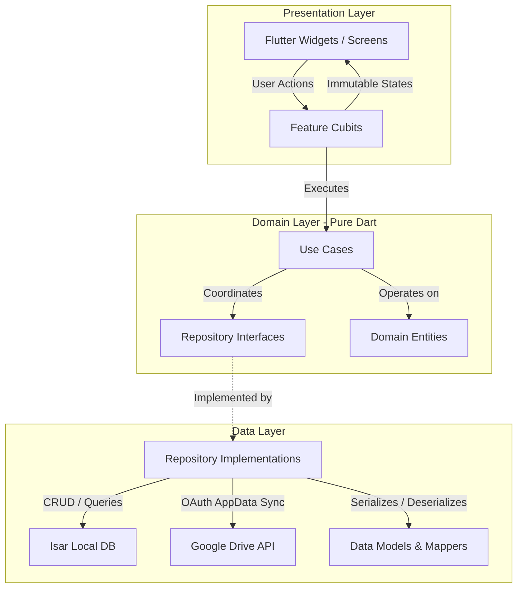

  

  # InvoiceFlow Pro

  **Offline-first Flutter invoicing application built with Clean Architecture, Cubit state management, Isar persistence, PDF generation, RTL localization, financial analytics, and backup workflows.**

  
  
  
  
  
  
  
  

---

## 📲 Try InvoiceFlow Pro

  <strong>Try the real app before purchasing the source code.</strong> 
  Offline-first invoicing • PDF invoices • Arabic & Urdu RTL • Backup • Reports

  <a href="https://github.com/madeel931/invoiceflow-pro-showcase/releases/tag/demo-v1.0.0">
    View Demo Release →
  </a>

> **Demo:** The Android demo uses the Free plan with a limit of **25 lifetime invoices**.

---

InvoiceFlow Pro is a commercial invoicing application designed for independent service businesses and contractors. This public repository serves as a **technical showcase and engineering case study**; the complete commercial source code is intentionally not included.

> **Technical Objective:** Designed to demonstrate production-oriented Flutter architecture, offline data management, financial workflows, document generation, and localization.

---

## 📱 Application Overview

<table>
  <tr>
    <td align="center" width="25%">
      
       <strong>Dashboard</strong>
       Financial overview, status counts, and KPIs
    </td>
    <td align="center" width="25%">
      
       <strong>Invoice Creation</strong>
       Structured customer, item, tax, and discount flow
    </td>
    <td align="center" width="25%">
      
       <strong>PDF Generation</strong>
       Vector document with QR code and share spooler
    </td>
    <td align="center" width="25%">
      
       <strong>Financial Trends</strong>
       Interactive revenue curves and cash-flow reporting
    </td>
  </tr>
  <tr>
    <td align="center" width="25%">
      
       <strong>Customer CRM</strong>
       Client directory with real-time balance tracking
    </td>
    <td align="center" width="25%">
      
       <strong>Items & Services</strong>
       Rate card catalog with pre-configured tax rates
    </td>
    <td align="center" width="25%">
      
       <strong>Status Filtering</strong>
       Compound status and date range filtering
    </td>
    <td align="center" width="25%">
      
       <strong>Cloud Backup</strong>
       Automated Google Drive AppData sync
    </td>
  </tr>
</table>

<strong>View Additional Interface Screens (Dark Mode, Business Profile, Activity Trail)</strong>

 

<table>
  <tr>
    <td align="center" width="25%">
      
       <strong>Business Profile</strong>
       Logo, Tax ID, address, and base currency
    </td>
    <td align="center" width="25%">
      
       <strong>Dark Mode</strong>
       AMOLED theme for low-light environments
    </td>
    <td align="center" width="25%">
      
       <strong>Audit Trail</strong>
       Chronological log of transactions and changes
    </td>
    <td align="center" width="25%">
      
       <strong>Status Breakdown</strong>
       Donut charts and volume distribution
    </td>
  </tr>
  <tr>
    <td align="center" width="25%">
      
       <strong>Local Backup</strong>
       Encrypted snapshot export and import
    </td>
    <td align="center" width="25%">
      
       <strong>Backup Status</strong>
       Storage summaries and device sync health
    </td>
    <td width="25%"></td>
    <td width="25%"></td>
  </tr>
</table>

---

## 🏗️ Architecture & System Design

The application implements a **feature-oriented Clean Architecture** enforcing unidirectional data flow and strict layer boundaries.

### Layer Responsibilities:
* **Presentation Layer:** State management handled via `flutter_bloc` (Cubit). Widgets subscribe to strongly typed states and dispatch user intents. Zero business or calculation logic resides in widgets.
* **Domain Layer:** Pure Dart module containing business entities, value objects, and granular use cases (`SaveInvoiceUseCase`, `CalculateTotalsUseCase`, `RestoreBackupUseCase`). Free from Flutter framework or database packages.
* **Data Layer:** Concrete repository implementations coordinating the embedded Isar database, file storage, and external Google Drive AppData synchronization.

---

## ⚙️ Key Engineering Highlights

### 1. Controlled Rounding & Monetary Calculations
Controlled rounding boundaries: monetary calculations (line subtotals, item-level compounding taxes, percentage discounts, and payment balances) are rounded consistently at defined domain/persistence boundaries to reduce cumulative rounding discrepancies. Overpayment guards protect against negative balances.

### 2. Embedded Offline-First Storage (Isar)
Utilizes an embedded database compiled to native C++ binaries. Complex invoice queries, status filters, and customer balance recalculations execute via indexed queries. Live query streams (`watchLazy`) automatically refresh views on write.

### 3. Native Vector PDF Compilation
Invoices and customer statements are generated directly on-device as vector PDFs using the `pdf` package. Dynamic layout pagination dynamically measures table rows to prevent orphaned elements and overlapping headers. Includes QR code generation for payment or invoice-related information.

### 4. Multilingual & Bidirectional Support (LTR / RTL)
Full support for English (`en`, LTR), Arabic (`ar`, RTL), and Urdu (`ur`, RTL). Custom script shaping (`arabic_reshaper`) and Unicode bidirectional analysis (`bidi`) ensure cursive Arabic and Urdu glyphs join correctly inside custom PDF canvases and UI components.

### 5. Dual-Layer Backup Engine
Combines local database snapshot export/import with automated Google Drive AppData synchronization. Backup integrity is validated with SHA-256 before restoration, reducing the risk of importing corrupted or altered archives.

---

## 🧩 Technical Challenges & Solutions

| Challenge | Problem | Engineering Approach | Verified Result |
|---|---|---|---|
| **Monetary Calculations** | Cumulative calculation drift in compound tax/discount math. | Evaluated taxes per item line before summing; rounded consistently at defined domain/persistence boundaries. | Consistent rounding behavior across multi-item statements. |
| **RTL PDF Typography** | Standard mobile PDF engines render Arabic/Urdu characters disconnected and in reverse order. | Passed strings through contextual character reshaping (`arabic_reshaper`) and bidirectional analysis (`bidi`) before canvas drawing. | Typographically correct, connected Arabic and Urdu text rendering on vector PDFs. |
| **Silent Restore Corruption** | Incomplete or interrupted backup file transfers could corrupt local database collections. | Calculated a SHA-256 checksum during creation and verified the digest against the archive prior to restore. | Corrupted or incomplete backup files fail validation before database writes are attempted. |
| **Android Alarm Constraints** | Android 13+ restricts `SCHEDULE_EXACT_ALARM`, risking crashes if permissions are withheld. | Wrapped scheduling in an error handler catching `exact_alarms_not_permitted` and falling back to inexact scheduling. | Graceful notification delivery fallback without unhandled exceptions on newer Android versions. |
| **Authentication UI Flicker** | Asynchronous Google Sign-In checks during initial page load caused transient "Disconnected" flashes. | Persisted the verified identity in local secure preferences and hydrated the UI state synchronously on launch. | Immediate, steady UI presentation with background token refresh. |

---

## 🛠️ Technology Stack

| Layer / Area | Technology | Purpose |
|---|---|---|
| **Framework** | Flutter 3.x | Multi-platform UI framework |
| **Language** | Dart 3.5+ | Core object-oriented programming language |
| **State Management** | flutter_bloc (Cubit) | Unidirectional reactive state management |
| **Architecture** | Clean Architecture | Separation of presentation, domain, and data |
| **Dependency Injection** | GetIt | Dependency injection / service locator |
| **Database** | Isar | Embedded local database with transactional writes |
| **Document Processing** | pdf & printing | Native vector PDF rendering and print spooling |
| **Internationalization** | arabic_reshaper & bidi | RTL glyph shaping and bidirectional text flow |
| **Data Visualization** | fl_chart | Interactive financial trend and donut charts |
| **Cloud Synchronization** | googleapis & google_sign_in | Private Google Drive AppData backup sync |
| **Notifications** | flutter_local_notifications | Local payment due date scheduling |
| **Routing** | GoRouter | Declarative, type-safe navigation stack |
| **Testing** | flutter_test & bloc_test | Comprehensive unit, widget, and state test suites |

---

## 🧪 Automated Testing

The codebase includes an extensive suite of automated tests verifying core business logic and UI behavior:

* **Suite Composition:** 93 automated test files are included in the project, covering domain calculations, repository mappings, state transition sequences, and layout mirroring.
* **Test Scope:** Unit, widget, and regression test suites validating domain calculations, Cubit state emissions, and bidirectional layout mirroring.
* **Static Analysis:** Clean pass under `flutter analyze` with 0 warnings, 0 errors, and strict `flutter_lints` adherence.

For detailed testing architecture and execution instructions, see [docs/TESTING.md](docs/TESTING.md).

---

## 📚 Technical Documentation

For in-depth architectural and implementation details, explore the documentation guides:

* [Technical Case Study](docs/CASE_STUDY.md) — Comprehensive design document detailing problem scope, data models, and decisions.
* [Architecture Guide](docs/ARCHITECTURE.md) — Deep dive into layer boundaries, dependency injection, and data flow diagrams.
* [Technical Highlights](docs/TECHNICAL_HIGHLIGHTS.md) — Detailed breakdown of financial math, PDF compilation, and RTL shaping.
* [Testing & Quality Assurance](docs/TESTING.md) — Overview of the test suite structure, Cubit tests, and regression harnesses.

---

## 💼 Commercial Availability

InvoiceFlow Pro is a commercial software product developed by **ADii Labs**.

The complete commercial source code is intentionally not included in this public showcase repository. 

For commercial licensing, white-label deployment, or custom Flutter software development inquiries:

* **Developer:** Muhammad Adeel
* **GitHub:** [@madeel931](https://github.com/madeel931)
* **Email:** [engineer.adeel.pk@gmail.com](mailto:engineer.adeel.pk@gmail.com)
* **LinkedIn:** [Muhammad Adeel](https://linkedin.com/in/muhammad-adeel-ab2a90144)

---

  Engineered by <strong>Muhammad Adeel</strong> &bull; ADii Labs

