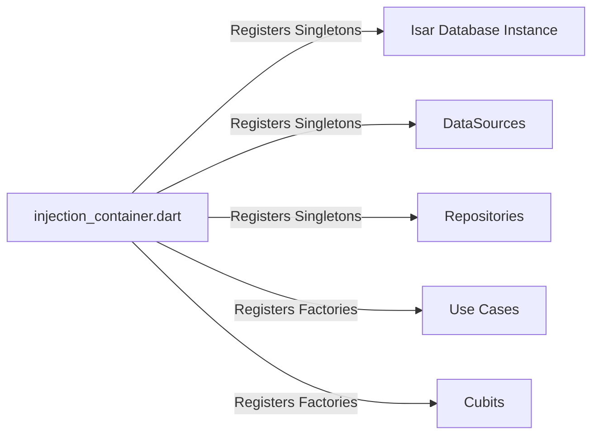

# InvoiceFlow Pro — Architecture Guide

## Overview

InvoiceFlow Pro is structured according to **feature-oriented Clean Architecture** principles. The application isolates business logic from UI frameworks, persistence engines, and external operating system APIs.

This document details the layer responsibilities, data flow, dependency injection graph, and module boundaries.

---

## High-Level Architecture

The architecture enforces a strict **unidirectional dependency rule**: outer layers may depend on inner layers, but inner layers must never depend on outer layers.

```mermaid
graph TD
    subgraph Presentation Layer
        W[Widgets / Pages]
        C[Cubits / BLoCs]
        S[UI States]
    end

    subgraph Domain Layer (Pure Dart)
        UC[Use Cases]
        E[Entities & Value Objects]
        RI[Repository Interfaces]
        Fail[Failures & Exceptions]
    end

    subgraph Data Layer
        RM[Repository Implementations]
        DS_L[Isar Local Datasource]
        DS_C[Google Drive Datasource]
        M[Data Models & Mappers]
    end

    subgraph Core & Infrastructure
        DI[Dependency Injection - GetIt]
        ROUTER[Navigation - GoRouter]
        PDF[PDF Generation Service]
        NOTIF[Notification Service]
        PREFS[App Preferences]
    end

    W -->|Dispatches Events| C
    C -->|Emits States| W
    C -->|Executes| UC
    UC -->|Operates on| E
    UC -->|Calls| RI
    RM -.->|Implements| RI
    RM -->|Queries / Writes| DS_L
    RM -->|Uploads / Downloads| DS_C
    RM -->|Transforms with| M
    DI -.->|Registers & Injects| C
    DI -.->|Registers & Injects| UC
    DI -.->|Registers & Injects| RM
```

---

## Directory & Feature Structure

The codebase is organized by business feature rather than technical archetype, grouping cohesive functionality together:

```text
lib/
├── config/                      # Global theme constants, palette, app config
│   ├── app_config.dart
│   └── app_theme.dart
├── core/                        # Shared infrastructure & cross-cutting concerns
│   ├── di/                      # GetIt service locator setup
│   ├── error/                   # Failure and Exception hierarchy
│   ├── router/                  # GoRouter configuration and route definitions
│   ├── services/                # Device services (PDF, notifications, preferences)
│   ├── usecases/                # Base use case contracts
│   └── widgets/                 # Reusable UI primitives (buttons, inputs, cards)
└── features/
    ├── analytics/               # Financial reporting, trend calculations, charts
    ├── backup/                  # Cloud (Google Drive) & local database snapshot engine
    ├── customers/               # Customer CRM, contact integration, statements
    ├── dashboard/               # High-level financial KPIs, unpaid counters, shortcuts
    ├── invoices/                # Invoice builder, line items, status workflow, PDF
    ├── items/                   # Service rate card & physical product inventory
    ├── onboarding/              # First-launch flow, business profile setup, demo seeder
    └── settings/                # Currency selection, tax rates, theme, language
```

Each feature folder follows the classic three-tier architecture:

```text
features/[feature_name]/
├── data/
│   ├── datasources/             # Direct database or external API interactions
│   ├── models/                  # Isar collections and JSON serialization mappers
│   └── repositories/            # Implementation of domain repository contracts
├── domain/
│   ├── entities/                # Core business models (pure Dart, immutable)
│   ├── repositories/            # Abstract contracts defining repository operations
│   └── usecases/                # Single-purpose business actions (e.g. SaveInvoiceUseCase)
└── presentation/
    ├── cubit/                   # State management logic and UI state definitions
    ├── pages/                   # Top-level routable screen widgets
    └── widgets/                 # Feature-specific subcomponents and layout cards
```

---

## Layer Responsibilities

### 1. Domain Layer (Innermost Layer)
* **Purity:** Pure Dart with zero Flutter or database dependencies.
* **Entities:** Immutable data structures defining fundamental concepts (`Invoice`, `Customer`, `Item`).
* **Repository Interfaces:** Abstract contracts (`InvoiceRepository`, `BackupRepository`) establishing what data operations exist, without specifying how they are implemented.
* **Use Cases:** Granular business operations (`CreateInvoiceUseCase`, `CalculateTotalsUseCase`, `RestoreBackupUseCase`). Each use case encapsulates a single business workflow and returns `Either<Failure, T>` using functional programming conventions (`dartz`).

### 2. Data Layer
* **Data Sources:** Direct interfaces to storage systems.
  * `IsarDatabase`: Embedded NoSQL database storing invoices, items, and customers.
  * `GoogleDriveBackupDatasource`: Interacts with Google Drive AppData folder using OAuth tokens.
  * `BackupPreferencesDatasource`: SharedPreferences storing local configuration and cached auth state.
* **Models:** Data transfer objects extending or mapping to domain entities. Models handle database serialization, schema versioning, and type conversions.
* **Repository Implementations:** Implement domain interfaces, coordinate data sources, map exceptions into domain `Failure` objects, and provide consistent abstractions to use cases.

### 3. Presentation Layer
* **State Management (Cubit):** Cubits listen to use case results and emit strongly typed, immutable UI states (e.g., `InvoiceListLoading`, `InvoiceListLoaded`, `InvoiceListError`).
* **Widgets & Pages:** Reactive Flutter widgets subscribing to state changes via `BlocBuilder`, `BlocConsumer`, and `BlocListener`.
* **Zero Business Logic in UI:** Widgets do not perform arithmetic, validate tax bounds, or interact directly with repositories.

---

## Dependency Injection Graph

Dependency resolution is handled centrally via **GetIt**:



* **Data Sources & Repositories:** Registered as lazy singletons to maintain consistent connection state and shared cache instances.
* **Use Cases:** Registered as lightweight singletons or factories.
* **Cubits:** Registered as factories or provided directly via `BlocProvider` in the widget tree to ensure proper lifecycle disposal when screens are popped.

---

## Routing & Navigation

Routing is centralized using **GoRouter**:
* **Declarative Routes:** All application routes (`/dashboard`, `/invoices`, `/invoices/new`, `/analytics`, `/backup`, `/settings`) are declared in a central route table.
* **Type-Safe Arguments:** Complex parameter passing (e.g., passing an invoice entity or ID to the PDF preview screen) is strongly typed.
* **Deep Linking & Back Navigation:** Standardized mobile back stack behavior respecting Android physical/gesture navigation and iOS edge-swipe gestures.

---

## Cross-Cutting Services

### 1. Document Rendering Engine (`PdfInvoiceService`)
Transforms domain entities into structured vector PDF documents using the `pdf` package. The service handles:
* Table layout pagination.
* Dynamic font loading for Arabic and Urdu glyphs (`NotoSansArabic`).
* Embedded QR code generation using `qr_flutter` payload encoders.

### 2. Notification Dispatcher (`LocalNotificationService`)
Coordinates local notifications for payment due dates using `flutter_local_notifications`:
* Computes target timezone timestamps via `timezone` and `flutter_timezone`.
* Gracefully degrades from `SCHEDULE_EXACT_ALARM` to inexact execution on restricted Android environments.

### 3. Cryptographic Verification Service
Employs `crypto` to calculate SHA-256 digests over database archive streams to guarantee snapshot validity before destructive restore operations.
