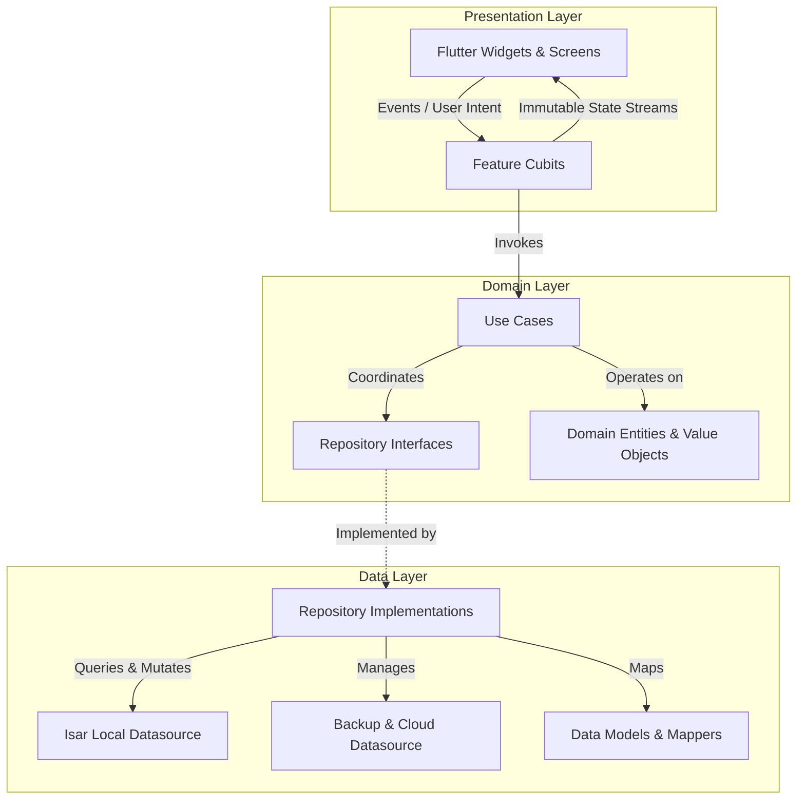

# InvoiceFlow Pro — Technical Case Study

## Overview

InvoiceFlow Pro is an offline-first mobile application designed to manage invoices, client relationships, product catalogs, and financial summaries for independent service professionals and small contractors.

Unlike conventional SaaS invoicing tools that rely heavily on persistent internet connectivity and third-party remote databases, InvoiceFlow Pro was built with a local-first philosophy. Core business workflows—including invoice authoring, financial recalculations, PDF generation, customer ledgers, and reporting—execute on the client device without requiring a network connection.

This case study documents the architectural decisions, technical challenges, data design, and implementation practices employed throughout development.

---

## Product Requirements

The application was designed to meet a comprehensive set of technical and functional specifications:

1. **Deterministic Local Execution:** Core invoicing workflows can operate without remote APIs, allowing users to create, review, search, and export invoices while offline.
2. **Consistent Financial Calculations:** Financial arithmetic (subtotals, taxes, percentage discounts, partial payments, and balances due) follows defined calculation and rounding rules to reduce cumulative discrepancies.
3. **High-Fidelity Document Generation:** On-device vector PDF compilation supporting dynamic business branding, multi-page layout pagination, payment QR metadata, and native print/share spooling.
4. **Multilingual and Bidirectional Presentation:** First-class support for Left-to-Right (LTR) and Right-to-Left (RTL) scripts—specifically English, Arabic, and Urdu—with appropriate script shaping.
5. **Data Resilience & Portability:** User-managed cloud backups via Google Drive App Data storage, combined with local database snapshot export and restore with SHA-256 integrity verification.
6. **Maintainable Codebase:** Clear separation of concerns, high testability, and decoupled layers allowing independent evolution of the database, business rules, and user interface.

---

## Architecture Decisions

The system follows a **feature-oriented Clean Architecture** pattern combined with **BLoC / Cubit** for reactive state management.

### Key Rationale:
* **Decoupled Domain Layer:** Domain entities (e.g., `Invoice`, `Customer`, `Item`, `PaymentRecord`) contain zero Flutter or database imports, allowing business logic to be tested independently.
* **Repository Abstraction:** Concrete storage technologies (Isar, SharedPreferences, File System) are encapsulated behind repository interfaces. Higher-level use cases do not depend directly on storage implementations.
* **Cubit for State Management:** Cubits were chosen over event-driven BLoCs for presentation logic to reduce boilerplate while preserving unidirectional data flow and predictable state transitions.

---

## Data Model

Persistence is managed using **Isar**, an embedded database engine with transactional writes compiled natively for mobile targets.

### Core Collections:
1. **InvoiceCollection (`Invoice`):**
   * Fields: `id`, `invoiceNumber`, `customerId`, `issueDate`, `dueDate`, `currency`, `subtotal`, `taxTotal`, `discountTotal`, `grandTotal`, `paidAmount`, `balanceDue`, `status`, `items`, `paymentHistory`.
   * Indexed fields support status, date, due-date, and customer-based queries.
2. **CustomerCollection (`Customer`):**
   * Fields: `id`, `name`, `phone`, `email`, `address`, `notes`, `createdAt`.
   * Relationships: Associated with invoices through identifiers and used for customer statements and balance calculations.
3. **ItemCollection (`Item`):**
   * Fields: `id`, `title`, `description`, `unitPrice`, `unitType` (e.g., hour, service, unit), `taxRate`, `createdAt`.
4. **ActivityHistoryCollection:**
   * Chronological application history capturing timestamped operations such as invoice creation, payment recording, and backup restoration.

---

## Financial Calculation Design

Handling financial data in client-side software requires explicit rules to reduce subtle rounding discrepancies:

* **Calculation Order:**
  $$\text{Line Subtotal} = \text{Quantity} \times \text{Unit Price}$$
  $$\text{Line Tax} = \text{Line Subtotal} \times \left(\frac{\text{Tax Rate}}{100}\right)$$
  $$\text{Subtotal} = \sum \text{Line Subtotal}$$
  $$\text{Tax Total} = \sum \text{Line Tax}$$
  $$\text{Grand Total} = \text{Subtotal} + \text{Tax Total} - \text{Discount Amount}$$
  $$\text{Balance Due} = \text{Grand Total} - \text{Paid Amount}$$
* **Rounding Rules:** Calculations use standardized 2-decimal monetary rounding at defined calculation/display boundaries.
* **Payment Validation:** Business rules prevent recorded payments from exceeding the remaining balance.

---

## Offline-First Strategy

The application adopts a **single source of truth** pattern centered on the local device:

1. **Direct Persistence:** User interactions write to the local Isar database.
2. **Reactive Query Streams:** UI layers observe Isar query streams (`watchLazy`) so views can reflect writes and updates without manual cache invalidation.
3. **Local Execution:** Search, sorting, invoice calculations, and reporting can operate without network round trips.

---

## PDF Generation

The document generation pipeline converts structured domain entities into printable, vector-rendered PDF documents on-device:

* **Technology:** Built using `pdf` and `printing` packages.
* **Layout Engine:** Multi-page layout logic measures content and computes page breaks to keep line items separated cleanly from headers and footers.
* **QR Metadata:** Invoices include QR code generation for payment or invoice-related information.
* **Sharing Spooler:** Integrates with platform sharing and printing capabilities for distributing generated documents.

---

## Localization & RTL

A primary commercial objective was comprehensive internationalization with seamless bidirectional layout behavior:

* **Supported Locales:** English (`en`, LTR), Arabic (`ar`, RTL), and Urdu (`ur`, RTL).
* **Text Reshaping:** Arabic and Urdu glyphs use `arabic_reshaper` and `bidi` processing for correct letter joining and mixed-script ordering inside PDF rendering.
* **Layout Mirroring:** Flutter directional widgets such as `Directionality`, `EdgeInsetsDirectional`, and `AlignmentDirectional` support automatic layout inversion based on the active locale.

---

## Backup Strategy

To provide data portability without requiring a dedicated application backend:

1. **Google Drive Integration:**
   * Utilizes official Google APIs (`googleapis`, `google_sign_in`) scoped to the user's private `drive.appdata` folder.
   * Backups are isolated from the user's regular Drive file tree.
2. **Local Snapshot Export & Restore:**
   * Generates database snapshot archives for local storage or device migration.
   * Backup integrity is protected by a SHA-256 checksum that is recalculated and validated before restoration.

> **Integrity note:** SHA-256 provides integrity verification; it is not encryption. The backup system should not be described as encrypted unless encryption is separately implemented.

---

## Testing Strategy

Testing was integrated into development to maintain stability across state changes and financial logic:

* **Unit Tests:** Pure Dart tests covering mathematical calculations, currency formatting, status transitions, and repository error mappings.
* **Widget Tests:** Verification of UI components under diverse locales and LTR/RTL layouts.
* **Cubit State Tests:** BLoC test harnesses verifying predictable state sequences.
* **Regression Test Suites:** Dedicated tests targeting edge cases such as overpayment validation, empty search criteria, and backup restore validation.

The project contains **93 automated test files** covering these areas. Run `flutter test` in a configured Flutter environment to execute the current suite.

---

## Engineering Challenges

| Challenge | Technical Root Cause | Resolution Strategy |
|---|---|---|
| **RTL Canvas Rendering in PDF** | Standard PDF text rendering requires explicit handling for Arabic/Urdu shaping and bidirectional ordering. | Pre-processed strings through an Arabic reshaper and Unicode bidirectional algorithm before submitting text runs to the PDF canvas. |
| **Silent Corrupt Restores** | Partial file transfers during manual backup imports can risk invalid database state. | Enforced SHA-256 verification against the backup payload before restoration. |
| **Alarm Permission Constraints** | Newer Android versions restrict exact alarms without appropriate permissions. | Implemented a runtime fallback path for environments where exact alarm scheduling is unavailable. |
| **Authentication UI Flicker** | Asynchronous Google Sign-In checks during initialization can cause transient connection-state changes. | Cached authentication state locally and hydrated the UI while background validation proceeds. |

---

## Lessons Learned

1. **Domain Isolation Simplifies Testing:** Keeping domain models decoupled from Isar annotations and Flutter UI libraries makes business rules easier to test independently.
2. **Offline-First Demands Strict Invariants:** Without a server to arbitrate transactions, client-side validation must prevent invalid states at the business-rule layer.
3. **Typography in PDF Requires Explicit Font Assets:** System fonts available to Flutter are not automatically available to PDF generation canvases; explicit font assets are required for consistent rendering.

---

## Future Improvements

*(Planned roadmap items — not currently implemented in production release)*

* **Multi-Device Local Sync:** Peer-to-peer Wi-Fi or Bluetooth synchronization between mobile and tablet devices.
* **OCR Receipt Scanning:** On-device text recognition to convert paper expense receipts into billable invoice items.
* **Custom PDF Template Editor:** Visual drag-and-drop designer allowing users to reconfigure invoice layout geometry.
