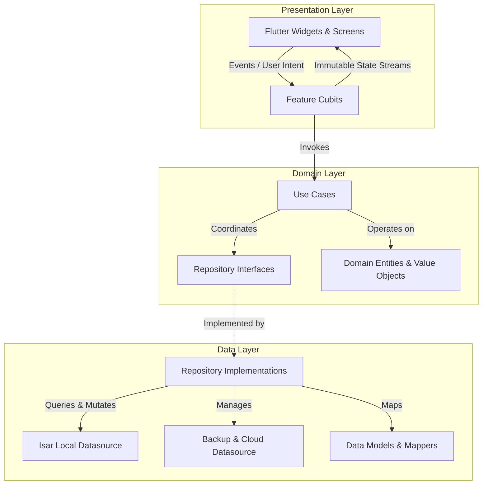

# InvoiceFlow Pro — Technical Case Study

## Overview

InvoiceFlow Pro is an offline-first mobile application designed to manage invoices, client relationships, product catalogs, and financial summaries for independent service professionals and small contractors. 

Unlike conventional SaaS invoicing tools that rely heavily on persistent internet connectivity and third-party remote databases, InvoiceFlow Pro was built with a local-first philosophy. Core business workflows—including invoice authoring, financial recalculations, PDF generation, customer ledgers, and reporting—execute entirely on the client device without latency or external dependencies.

This case study documents the architectural decisions, technical challenges, data design, and implementation practices employed throughout development.

---

## Product Requirements

The application was designed to meet a comprehensive set of technical and functional specifications:

1. **Deterministic Local Execution:** Zero reliance on remote APIs for everyday invoicing tasks. Users must be able to create, review, search, and export invoices completely offline.
2. **Strict Financial Accuracy:** Financial arithmetic (subtotals, compounding item taxes, percentage discounts, partial payments, and balances due) must remain immutable, verifiable, and free from floating-point distortion.
3. **High-Fidelity Document Generation:** On-device vector PDF compilation supporting dynamic business branding, multi-page layout pagination, payment QR metadata, and native print/share spooling.
4. **Multilingual and Bidirectional Presentation:** First-class support for Left-to-Right (LTR) and Right-to-Left (RTL) scripts—specifically English, Arabic, and Urdu—with appropriate script shaping and number localization.
5. **Data Resilience & Portability:** Automated user-managed cloud backups via Google Drive App Data storage, combined with cryptographic SHA-256 local database snapshot export and restore.
6. **Maintainable Codebase:** Clear separation of concerns, high testability, and decoupled layers allowing independent evolution of the database, business rules, and user interface.

---

## Architecture Decisions

The system follows a **feature-oriented Clean Architecture** pattern combined with **BLoC / Cubit** for reactive state management.

### Key Rationale:
* **Decoupled Domain Layer:** Domain entities (e.g., `Invoice`, `Customer`, `Item`, `PaymentRecord`) contain zero Flutter or database imports. This ensures pure Dart business logic that can be tested in isolation with high-speed unit tests.
* **Repository Abstraction:** Concrete storage technologies (Isar, SharedPreferences, File System) are encapsulated behind abstract repository interfaces. If the persistence provider is swapped or upgraded, higher-level use cases remain untouched.
* **Cubit for State Management:** Cubits were chosen over event-driven BLoCs for presentation logic to minimize boilerplate while preserving unidirectional data flow and deterministic state streams.

---

## Data Model

Persistence is managed using **Isar NoSQL**, an embedded ACID-compliant database engine compiled natively for mobile targets.

### Core Collections:
1. **InvoiceCollection (`Invoice`):**
   * Fields: `id`, `invoiceNumber`, `customerId`, `issueDate`, `dueDate`, `currency`, `subtotal`, `taxTotal`, `discountTotal`, `grandTotal`, `paidAmount`, `balanceDue`, `status`, `items`, `paymentHistory`.
   * Indexes: Indexed by `status`, `issueDate`, `dueDate`, and `customerId` for fast compound filtering.
2. **CustomerCollection (`Customer`):**
   * Fields: `id`, `name`, `phone`, `email`, `address`, `notes`, `createdAt`.
   * Relationships: Associated with invoices through primary identifiers; supports calculated aggregations for customer statements.
3. **ItemCollection (`Item`):**
   * Fields: `id`, `title`, `description`, `unitPrice`, `unitType` (e.g., hour, service, unit), `taxRate`, `createdAt`.
4. **ActivityHistoryCollection:**
   * Immutable audit trail capturing timestamped operations (`invoice_created`, `payment_recorded`, `backup_restored`).

---

## Financial Calculation Design

Handling financial data in client-side software requires strict invariants to prevent subtle rounding discrepancies:

* **Calculation Order:**
  $$\text{Line Subtotal} = \text{Quantity} \times \text{Unit Price}$$
  $$\text{Line Tax} = \text{Line Subtotal} \times \left(\frac{\text{Tax Rate}}{100}\right)$$
  $$\text{Subtotal} = \sum \text{Line Subtotal}$$
  $$\text{Tax Total} = \sum \text{Line Tax}$$
  $$\text{Grand Total} = \text{Subtotal} + \text{Tax Total} - \text{Discount Amount}$$
  $$\text{Balance Due} = \text{Grand Total} - \text{Paid Amount}$$
* **Rounding Rules:** Calculations round to 2 decimal places using standardized banking rules at the final display and persistence boundaries, preventing cumulative fractional cent drift across line items.
* **State Immutability:** An invoice marked as `Paid` or `Cancelled` is protected against accidental modification; editing requires explicit user confirmation or status reversion.

---

## Offline-First Strategy

The application adopts a **single source of truth** pattern centered on the local device:

1. **Direct Persistence:** All user interactions write immediately to the local Isar database.
2. **Reactive Query Streams:** UI layers observe live database streams (`watchLazy`), ensuring views automatically reflect writes, deletes, or batch updates without manual cache invalidation.
3. **Zero Sync Latency:** Because the local database is authoritative, search, sorting, and reporting operate with sub-millisecond execution times.

---

## PDF Generation

The document generation pipeline converts structured domain entities into printable, vector-rendered PDF documents on-device:

* **Technology:** Built using `pdf` and `printing` packages.
* **Layout Engine:** Multi-page layout adapter that measures content heights dynamically to ensure line items flow cleanly across page boundaries without overlapping footers.
* **QR Metadata:** Invoices include an embedded QR code carrying invoice metadata (invoice identifier, issue date, grand total, and optional payment payload) enabling scanning by customers or accounting teams.
* **Sharing Spooler:** Integrates with iOS `UIActivityViewController` and Android `Intent.ACTION_SEND` for single-tap transmission to WhatsApp, Mail, or localized system printers.

---

## Localization & RTL

A primary commercial objective was comprehensive internationalization with seamless bidirectional layout behavior:

* **Supported Locales:** English (`en`, LTR), Arabic (`ar`, RTL), and Urdu (`ur`, RTL).
* **Text Reshaping:** Arabic and Urdu glyphs require contextual shaping and bidirectional analysis. The PDF rendering engine incorporates `arabic_reshaper` and `bidi` to ensure proper letter-joining and reverse text flow inside non-native PDF canvases.
* **Layout Mirroring:** Flutter's native directional widgets (`Directionality`, `EdgeInsetsDirectional`, `AlignmentDirectional`) ensure navigation bars, icons, padding, and data cards automatically invert orientation based on active locale.

---

## Backup Strategy

To ensure data sovereignty without maintaining a costly, risk-bearing cloud backend:

1. **Google Drive Integration:**
   * Utilizes official Google APIs (`googleapis`, `google_sign_in`) scoped strictly to the user's private `drive.appdata` folder.
   * Backups are invisible in regular Drive file trees and cannot be accessed or tampered with by external utilities.
   * Auto-backup lifecycle observer performs quiet daily synchronization upon app pause/resume when enabled.
2. **Local Snapshot Export & Restore:**
   * Generates compressed database dumps that users can share, air-drop, or archive.
   * Every backup archive embeds a SHA-256 cryptographic checksum. During restore, the file hash is recalculated and compared against the manifest to prevent corrupt or incomplete states from entering the database.

---

## Testing Strategy

Testing was integrated into every development cycle to maintain stability across state changes and financial logic:

* **Unit Tests:** Pure Dart tests verifying mathematical accuracy, currency formatting, status transitions, and repository error mappings.
* **Widget Tests:** Verification of UI components under diverse locales (LTR vs. RTL layout verification, date pickers, and filter modals).
* **Cubit State Tests:** BLoC test harnesses verifying that specific events trigger predictable state sequences (`Loading` $\rightarrow$ `Success` or `Loading` $\rightarrow$ `Failure`).
* **Regression Test Suites:** Dedicated tests targeting known edge cases, such as overpayment validation, empty search criteria, and background lifecycle restore locks.

---

## Engineering Challenges

| Challenge | Technical Root Cause | Resolution Strategy |
|---|---|---|
| **RTL Canvas Rendering in PDF** | Standard PDF engines render Arabic/Urdu strings backwards without ligatures. | Pre-processed strings through an Arabic reshaper and Unicode bidirectional algorithm prior to submitting text runs to the PDF canvas. |
| **Silent Corrupt Restores** | Partial file transfers during manual backup imports risked corrupting the Isar database instance. | Enforced cryptographic SHA-256 verification against the file payload before releasing the database write lock. |
| **Alarm Permission Deadlocks** | Newer Android versions (API 33+) restrict exact alarms without explicit manifest declarations and system toggles. | Implemented a graceful runtime fallback that catches `exact_alarms_not_permitted` and falls back to `inexactAllowWhileIdle`. |
| **Authentication UI Flicker** | Asynchronous Google Sign-In checks during screen initialization caused transient "Disconnected" state flashes. | Cached the verified authentication identity locally in secure preferences to render the connected state synchronously while background validation proceeds. |

---

## Lessons Learned

1. **Domain Isolation Simplifies Testing:** Keeping domain models completely decoupled from Isar annotations or Flutter UI libraries allowed rapid test suite execution and guaranteed zero framework leakage into core business rules.
2. **Offline-First Demands Strict Invariants:** Without a server to arbitrate transactions, client-side data validation must be comprehensive at the use case layer to prevent invalid states.
3. **Typography in PDF requires explicit font assets:** System fonts available in Flutter are not automatically bundled into PDF generation canvases. Explicit bundling of OpenType/TrueType fonts is essential for cross-platform visual parity.

---

## Future Improvements

*(Planned roadmap items — not currently implemented in production release)*

* **Multi-Device Local Sync:** Peer-to-peer Wi-Fi or Bluetooth synchronization between mobile and tablet devices.
* **OCR Receipt Scanning:** On-device text recognition to convert paper expense receipts into billable invoice items.
* **Custom PDF Template Editor:** Visual drag-and-drop designer allowing users to reconfigure invoice layout geometry.
