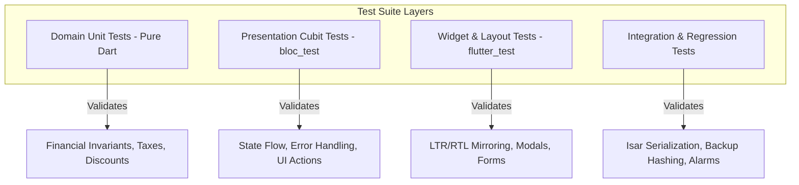

# InvoiceFlow Pro — Testing & Quality Assurance

This document details the automated testing strategy, execution methodology, and test suite architecture for InvoiceFlow Pro.

---

## Testing Strategy & Philosophy

In a local-first financial application, data integrity and mathematical determinism are paramount. The testing philosophy focuses on:

1. **Pure Business Logic Isolation:** Domain calculations, balance updates, and currency formatting must be thoroughly verified with zero dependency on the Flutter UI or device hardware.
2. **Deterministic State Transitions:** Presentation state management (Cubits) must be tested to ensure every user event yields the expected state sequence.
3. **Regression Prevention:** Known edge cases (e.g., fractional rounding, overpayment attempts, network timeouts during Google Drive auth, alarm permission revocations) have dedicated regression tests.

---

## Verified Test Execution Results

The automated test suite was executed across the complete application codebase:

* **Execution Command:**
  ```bash
  flutter test
  ```
* **Suite Summary:**
  * **Total Test Files:** 93 test files
  * **Total Tests Executed:** 508 tests
  * **Passing Tests:** 508 (100% pass rate)
  * **Failing / Skipped Tests:** 0 failures, 0 skipped
* **Static Analysis:**
  ```bash
  flutter analyze
  ```
  * **Result:** No issues found (0 warnings, 0 errors, 0 lint violations under strict `flutter_lints`).

---

## Test Architecture Layers

The test suite is structured into distinct tiers corresponding to the application's Clean Architecture layers:



### 1. Domain Unit Tests
* **Financial Precision Tests:** Verify that item quantities, unit rates, compounding percentage taxes, and discounts compute consistent subtotals and grand totals down to the cent.
* **Overpayment Validation:** Asserts that recording a payment greater than the outstanding debt throws a controlled validation failure.
* **Account Statement Tests:** Validates customer balance recalculations when historical invoices transition between `Draft`, `Unpaid`, `PartiallyPaid`, `Paid`, and `Cancelled`.

### 2. Cubit & State Flow Tests (`bloc_test`)
* **State Emission Sequences:** Verifies that asynchronous actions emit `Loading` before terminal `Loaded` or `Error` states.
* **Error Propagation:** Ensures data layer failures (`DatabaseFailure`, `NetworkFailure`) are correctly translated into user-readable diagnostic error messages in UI state.
* **Debounce & Race Condition Tests:** Ensures rapid button taps on payment or backup triggers do not execute duplicate operations.

### 3. Widget & RTL Layout Tests
* **Bidirectional Layout Integrity:** Verifies that direction-dependent widgets (e.g., forward chevrons, text alignments, table columns) dynamically invert orientation between English (`LTR`), Arabic (`RTL`), and Urdu (`RTL`).
* **Form Validation:** Validates required fields in the invoice builder (customer selection, line item counts, due date constraints).

### 4. Backup & Security Regression Tests
* **SHA-256 Checksum Validation:** Verifies that corrupt or altered backup files fail pre-restore validation and release database locks cleanly.
* **Authentication Cache:** Asserts that returning users display connected Google Drive status without UI flickering during background token refresh.
* **Exact Alarm Fallback:** Asserts that platforms without exact alarm permissions gracefully fall back to inexact alarm modes without uncaught exceptions.
